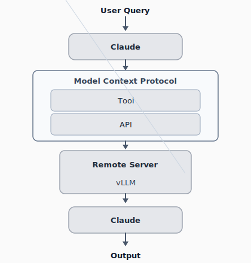

# MCP-LLM Judge

An MCP-based **automated story quality evaluation** system. It is a proof-of-concept implementation of the Mixture-of-Judges idea via the **Model Context Protocol**, aimed at delegating fine-grained judging work to **open-source evaluator models** instead of relying solely on expensive proprietary evaluation APIs.

---

## Purpose

- **Problem**: LLM-as-a-judge is powerful, but large-scale benchmarking on commercial APIs alone incurs high cost and wasted API resources.
- **Approach**: Separate orchestration from inference with MCP, and route evaluation sub-tasks to a **remote open-source inference backend** (e.g., vLLM).
- **Validation task**: This repository implements an **automated evaluation** pipeline that scores creative-writing stories with **22 fine-grained metrics** (positive and negative axes).

---

## Architecture (concept)

A **user query** is handled by **Claude**, which calls **Model Context Protocol** tools and APIs. Those calls are routed to a **remote server** running **vLLM** (open-source evaluator models). Model outputs are returned through that stack so **Claude** can produce the final **output**. This repository implements the **MCP Tool** surface and the **API** path that forwards requests to a remote OpenAI-compatible endpoint.




Plain-text view:

```
User Query → Claude → MCP (Tool → API) → Remote Server / vLLM → Claude → Output
```

The **two-stage evaluation pipeline** described in the paper (for offline validation and routing simulation) works as follows:

1. **Stage 1 — Outlier / coarse error filter**: To reduce collapse and instruction-following failures in smaller models, candidates are filtered against a reference using **MAE / RMSE**, then models are chosen for more complex tasks.
2. **Stage 2 — Ordinal alignment**: Remaining candidates are assessed less on absolute scores and more on **rank agreement** (Spearman ρ, Kendall τ) with a gold-standard judge, then fed into heuristic routing.

This repository is **not** a full live router; it provides **MCP tools plus evaluation logic** aligned with the architecture above.

---

## Evaluation task (design)

- Stories are scored in **22 categories** on a **0–20** scale, covering positive dimensions (narrative quality, style, creativity, etc.) and negative ones (e.g., triteness, tell-don’t-show).
- Tools such as `evaluate_full_dataset` read a dataset CSV and, per row, write category scores plus **standalone / contextual creativity** and analysis of their gap to a results file.

---